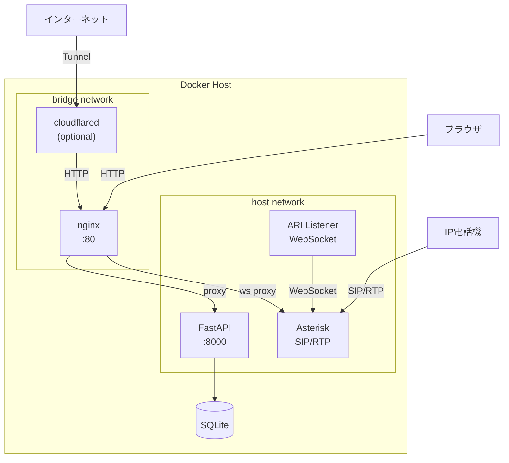
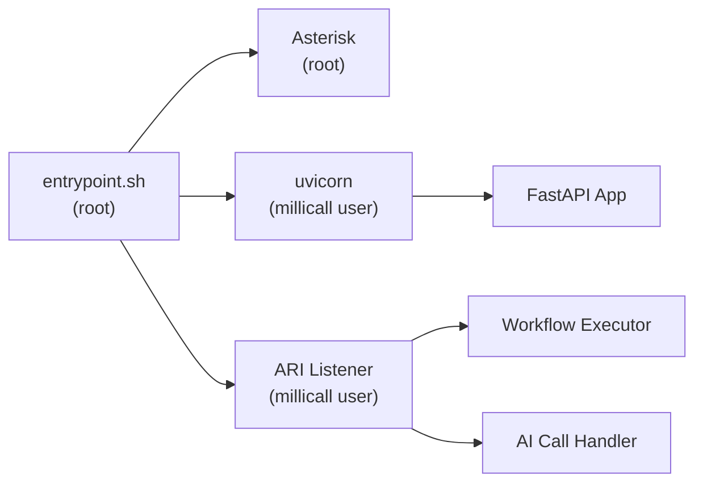
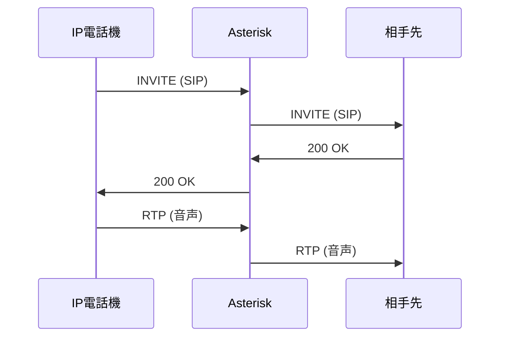
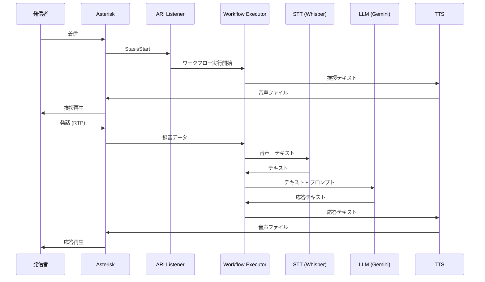

## 全体構成

## コンテナ構成

| サービス | ネットワーク | 役割 |
|---------|------------|------|
| **millicall** | host | Asterisk + FastAPI + ARI listener を1コンテナで実行 |
| **frontend** | bridge (port 80) | nginx でReact SPAを配信、APIへのリバースプロキシ |
| **cloudflared** | bridge (optional) | Cloudflare Tunnel による外部アクセス |

### なぜ millicall は host network なのか

Asterisk は SIP (UDP 5060) と RTP (UDP 10000-10100) で大量の UDP ポートを使用します。Docker のブリッジネットワークでは NAT が介在し、SIP の NAT 越え問題が発生するため、Asterisk コンテナは `network_mode: host` で動作させています。

frontend と cloudflared は SIP/RTP を扱わないため、ブリッジネットワークでネットワーク分離しています。

## プロセス構成

millicall コンテナ内では3つのプロセスが動作します:

- **Asterisk** — root で実行（SIPポートのバインドに必要）
- **uvicorn (FastAPI)** — millicall ユーザーで実行（Web API）
- **ARI Listener** — millicall ユーザーで実行（通話イベントのハンドリング）

## データフロー

### 通常の電話通話

### AI ワークフロー通話

## データベース

SQLite を使用。Docker volume `millicall-data` に永続化されます。

主なテーブル:

| テーブル | 内容 |
|---------|------|
| extensions | 内線番号 |
| peers | SIP ピア（電話機アカウント） |
| trunks | 外線トランク |
| devices | 電話機デバイス |
| workflows | ワークフロー定義 |
| contacts | 電話帳 |
| users | 管理ユーザー |
| settings | システム設定（APIキー等） |
| call_logs / call_messages | AI通話ログ |
| cdr_records | 通話詳細記録 |
