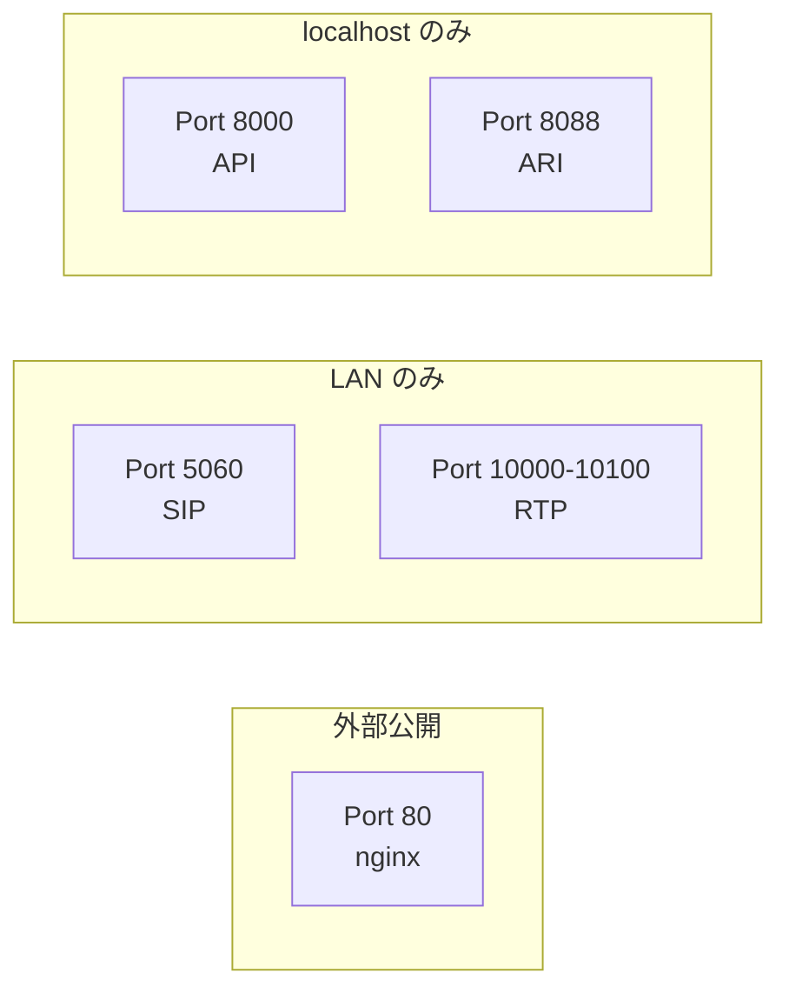

## 認証

### Web UI / API

- JWT ベースの認証（HttpOnly cookie + Authorization header）
- bcrypt によるパスワードハッシュ
- ログインエンドポイントにレート制限（5分間10回まで）

### Asterisk (SIP)

- Digest 認証（ピアごとのユーザー名/パスワード）
- ARI は localhost のみからアクセス可能

### MCP (Model Context Protocol)

- OAuth 2.0 + PKCE による認証
- Millicall のユーザーアカウントでログイン

## シークレット管理

すべてのシークレットは環境変数で管理します。ソースコードにデフォルトのパスワードは含まれていません。

| シークレット | 未設定時の動作 |
|------------|---------------|
| `JWT_SECRET` | ランダム生成（再起動でセッション無効化） |
| `ADMIN_PASSWORD` | ランダム生成（ログに出力） |
| `ARI_PASSWORD` | ランダム生成（ari.conf と自動同期） |

## 監査ログ

セキュリティ上重要な操作は監査ログに記録されます:

- ログイン成功/失敗
- ユーザーの作成/削除
- パスワードの変更/リセット

ログ形式:

```
2026-03-24T02:15:00 AUDIT action=auth.login actor=admin ip=192.168.1.9
2026-03-24T02:16:30 AUDIT action=user.create actor=admin target=operator1 detail=role=user
```

## コンテナセキュリティ

- Web アプリと ARI リスナーは非 root ユーザー (`millicall`) で実行
- Asterisk は SIP ポートのバインドに root が必要なため root で実行
- Docker volume のパーミッションは起動時に自動修正

## ネットワークセキュリティ



詳細は[ファイアウォール設定](/millicall-pbx/setup/firewall/)を参照してください。

## 注意事項

### プロビジョニング

電話機のプロビジョニングは HTTP (非暗号化) で行われます。プロビジョニング設定には SIP 認証情報が含まれるため、信頼できるネットワーク内でのみ使用してください。

### SIP パスワード

SIP ピアのパスワードはデータベースに平文で保存されます。これは Asterisk の Digest 認証に必要な仕様上の制約です。データベースファイルへのアクセス制御を適切に行ってください。
