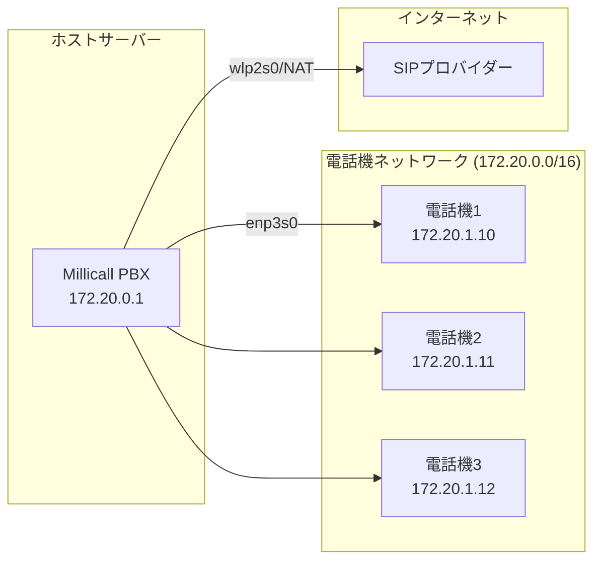

IP 電話機を専用のネットワークセグメントで運用する場合の設定ガイドです。既存ネットワークに電話機を接続する場合はこの手順は不要です。

## 構成例



## セットアップ

リポジトリに含まれるスクリプトで一括設定できます:

```bash
sudo bash deploy/setup-host-network.sh
```

このスクリプトは以下を設定します:

1. **NIC に静的 IP を割り当て** — `enp3s0` に `172.20.0.1/16`
2. **IP フォワーディング有効化** — 電話機がインターネットにアクセスするため
3. **NAT ルール** — 電話機ネットワークからインターネットへのマスカレード
4. **DHCP サーバー** — dnsmasq で電話機に自動 IP 付与

## カスタマイズ

環境に合わせて `deploy/setup-host-network.sh` を編集してください:

| 項目 | デフォルト | 変更例 |
|------|-----------|--------|
| NIC 名 | `enp3s0` | お使いの NIC 名 |
| PBX の IP | `172.20.0.1` | 任意の IP |
| DHCP レンジ | `172.20.1.1 - 172.20.254.254` | 環境に合わせて |
| 外部 NIC | `wlp2s0` | `eth0` など |

PBX の IP を変更した場合、`.env` の `PBX_BIND_ADDRESS` も同じ値に設定してください。

## dnsmasq の DHCP リース

デバイス管理画面で IP 電話機を自動検出するには、dnsmasq のリースファイルをマウントします。`docker-compose.yml` の millicall サービスの volumes に追加:

```yaml
volumes:
  - /var/lib/misc/dnsmasq.leases:/var/lib/misc/dnsmasq.leases:ro
```
