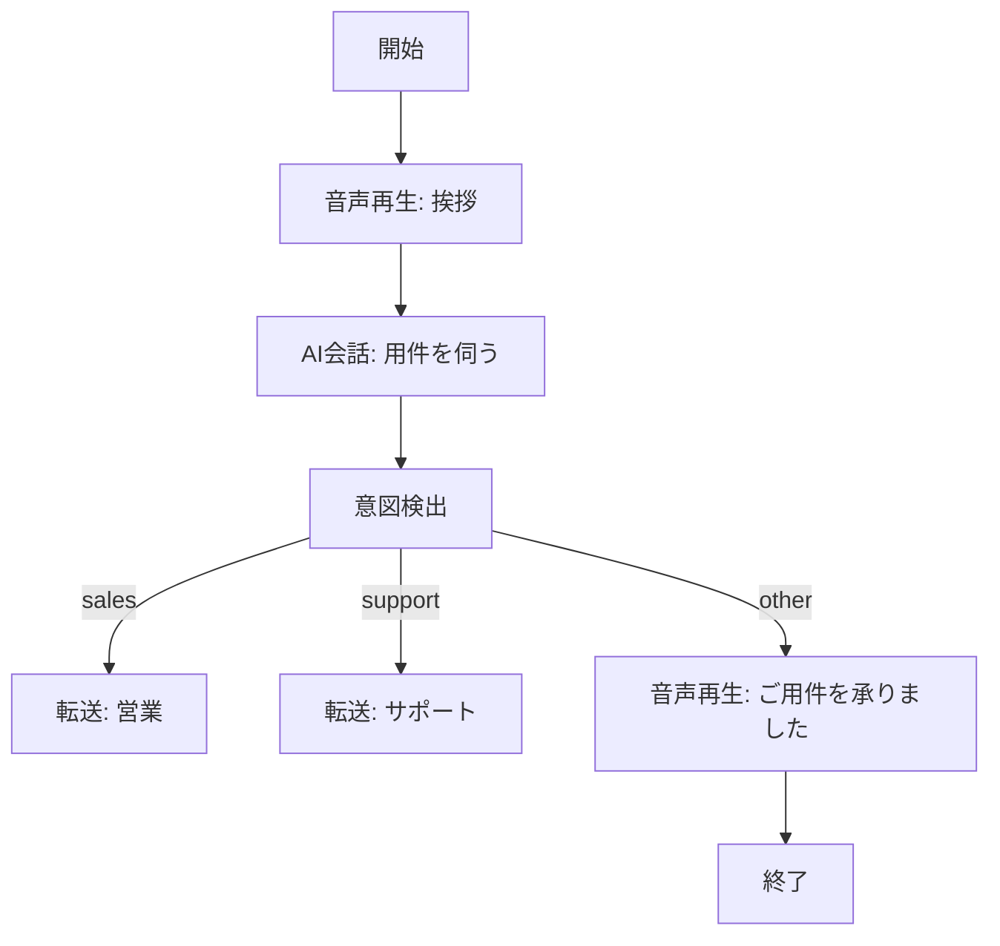
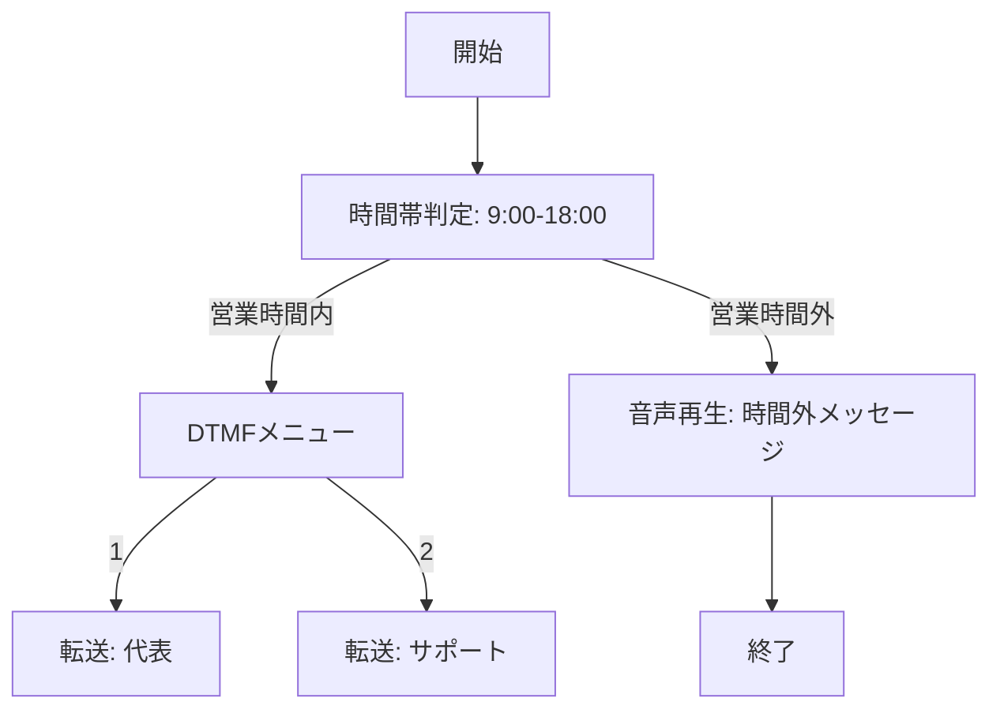

import { Image } from 'astro:assets';
import editor from '../../../assets/screenshots/workflow-editor.webp';

ワークフロー機能では、電話の着信に対する応対フローをビジュアルエディタで構築できます。AIによる自動会話、DTMF（プッシュボタン）メニュー、条件分岐などを組み合わせて、柔軟な電話応対を実現します。

<Image src={editor} alt="ワークフローエディタ" />

## ワークフローの作成

1. 内線アカウント画面で **ワークフロー追加** をクリック
2. ワークフロー名、内線番号を入力して保存
3. **エディタ** をクリックしてビジュアルエディタを開く

## ノードの種類

### 基本ノード

| ノード | 説明 |
|--------|------|
| **開始** | フローの開始点 |
| **終了** | 通話の切断 |
| **音声再生** | TTS テキストまたは音声ファイルの再生 |
| **転送** | 他の内線への転送 |

### 入力ノード

| ノード | 説明 |
|--------|------|
| **DTMFメニュー** | プッシュボタンによる選択肢の提示 |
| **DTMF入力** | 数字入力の取得（暗証番号など） |

### AI ノード

| ノード | 説明 |
|--------|------|
| **AI会話** | LLM を使った自律的な電話応対 |
| **意図検出** | 発話内容からインテントを分類 |
| **情報収集** | 会話形式で複数の情報を順に取得 |

### 制御ノード

| ノード | 説明 |
|--------|------|
| **条件分岐** | 変数の値に基づく分岐 |
| **時間帯判定** | 営業時間内/外での分岐 |
| **変数設定** | 変数に値を代入 |
| **API呼び出し** | 外部HTTPエンドポイントの呼び出し |
| **サブワークフロー** | 別のワークフローを呼び出し |

## AI によるワークフロー自動生成

ワークフローエディタ上部の **AI生成** ボタンから、自然言語でワークフローを自動生成できます。

### 使い方

1. エディタで **AI生成** ボタンをクリック
2. 作りたいフローを日本語で記述

   例: `営業時間内は挨拶してからDTMFメニューを出す。1番で営業担当に転送、2番で技術サポートに転送。営業時間外は留守電メッセージを流して切る。`

3. **生成** ボタンをクリック
4. Gemini がフロー定義を生成し、エディタ上にノードとエッジが配置されます
5. 必要に応じて手動で調整

### 生成に必要な設定

AI 生成には Google AI API キーが必要です。**詳細設定** 画面または `.env` の `GOOGLE_API_KEY` に設定してください。

## テンプレート変数

ワークフロー内のテキストフィールドでは `{{変数名}}` の形式でテンプレート変数が使えます。

| 変数名 | 内容 |
|--------|------|
| `last_user_text` | 直前のユーザー発話（STT結果） |
| `last_ai_response` | 直前のAI応答 |
| `dtmf_result` | DTMF入力結果 |
| `detected_intent` | 意図検出結果 |
| `api_result` | API呼び出しのレスポンス |
| カスタム変数 | 「変数設定」ノードで定義した任意の変数 |

## フローの例

### QuickCall — AI電話受付

### 営業時間分岐

